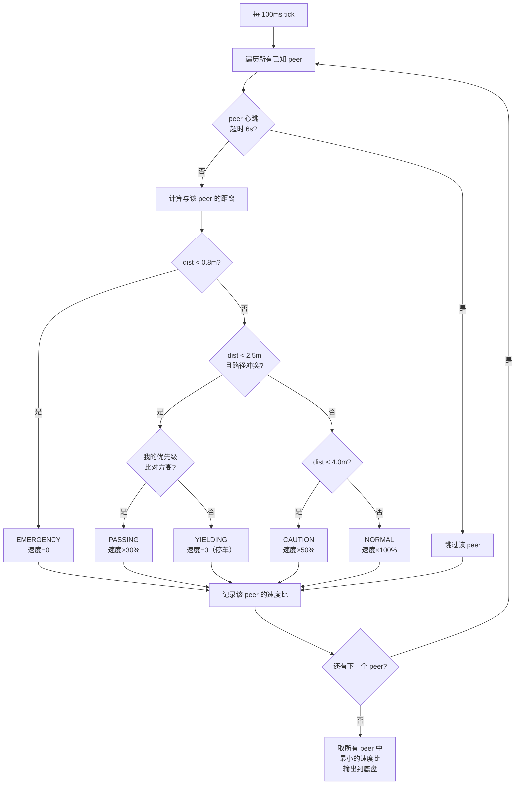
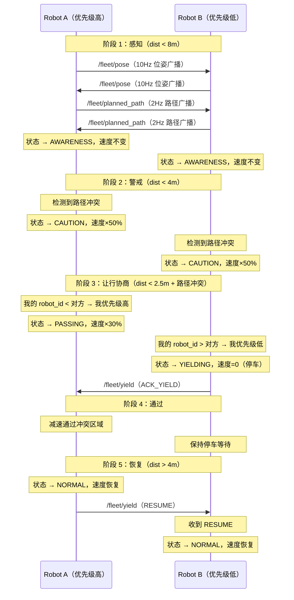
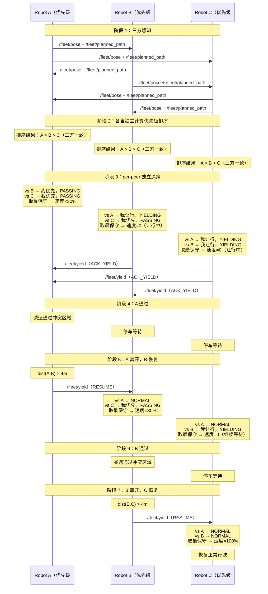

> 自动同步自 Notion，同步时间: 2026-04-15
> 页面 ID: `6fa03586-2f2a-46e3-8e8a-93b821e9bf28`
> 原始链接: https://www.notion.so/6fa035862f2a46e38e8a93b821e9bf28

# 多机避撞协同系统 · PRD

> 📋 **多机避撞协同系统 — 产品需求文档（PRD）**
版本 V1.0 · 2026-04-15

---

## 1. 背景与目标

### 1.1 背景

我司楼宇讲解机器人在同一楼层部署多台（当前 2 台，近期扩展至 3 台），各机器人独立运行 Nav2 导航栈执行讲解、引导等任务。当前各机器人之间**无通信能力**，在走廊、T 字路口等狭窄区域存在碰撞风险。

**核心矛盾**：机器人本体只具备局部感知的避障能力（激光雷达 / 深度相机），无法获知对方的**意图**（规划路径、行进方向、任务状态），导致两车面对面时反应滞后甚至死锁。

### 1.2 产品目标

| **目标维度** | **具体目标** | **衡量标准** |
| --- | --- | --- |
| **安全性** | 同楼层多机运行零碰撞 | 连续 7 天 ×8h 运行无碰撞事件 |
| **效率** | 避撞协调对任务完成率的影响可控 | 单次让行导致的延迟 ≤ 15s |
| **Nav2 原生集成** | 通过自定义行为树节点集成，Nav2 原生理解让行状态 | 让行时不触发 ProgressChecker 超时 |
| **可扩展** | 架构支持 3 台及以上 | 3 台场景全功能验证通过 |
| **低带宽** | 协同通信不占用大量无线资源 | 无线流量 ≤ 10 KB/s（3 台） |

### 1.3 非目标（Scope Out）

- ❌ 全局任务调度（由上层 Fleet Manager 负责）

- ❌ 跨楼层协同（不同楼层天然隔离）

- ❌ 云端监控（后续通过 Zenoh 桥接扩展）

- ❌ 异构机器人混编（当前仅同型号）

---

## 2. 用户与场景

### 2.1 用户角色

| **角色** | **诉求** |
| --- | --- |
| 现场部署工程师 | 配置简单，启动即生效，无需调参 |
| 运维人员 | 能看到协调日志，异常可追溯 |
| 软件开发工程师 | 模块独立，接口清晰，易于测试和扩展 |

### 2.2 核心使用场景

<!-- block type: heading_4 -->

```javascript
Robot A ──►              ◄── Robot B
═══════════════走廊══════════════════
```

两台机器人在走廊中面对面相向行驶。系统需在安全距离内完成让行协商，低优先级方靠边停车，高优先级方减速通过，通过后双方恢复正常。

<!-- block type: heading_4 -->

```javascript
Robot A ──►    Robot B ──►  (A 更快)
═══════════════走廊══════════════════
```

后方机器人速度更快，逐渐接近前方机器人。系统需让后方机器人减速保持安全距离，而不触发不必要的让行协商。

<!-- block type: heading_4 -->

```javascript
         Robot B
           │
           ▼
Robot A ──►──┤
══════════ T 字路口
```

两台机器人从不同方向驶入同一路口。系统需通过路径冲突预测，在进入路口前完成协商。

<!-- block type: heading_4 -->

三台机器人同时接近同一区域，系统需按优先级排队依次通过，防止饿死（starvation）。

---

## 3. 硬件约束

### 3.1 机器人本体

| **组件** | **规格** | **说明** |
| --- | --- | --- |
| 计算单元 1 | NVIDIA Orin | 感知 / SLAM / 导航 |
| 计算单元 2 | Thor | 运动控制 / 执行器 |
| 机内通信 | 千兆以太网（eth0） | Orin ↔ Thor，ROS 2 DDS |
| 机间通信 | WiFi 5GHz（wlan0） | 同楼层机器人间协同 |
| DDS 中间件 | CycloneDDS | ROS 2 默认 RMW |

### 3.2 网络拓扑

```javascript
┌──────── Robot A ────────┐     WiFi 5GHz      ┌──────── Robot B ────────┐
│ Orin ◄──eth0──► Thor    │◄═══════════════════►│ Orin ◄──eth0──► Thor    │
│      Domain 0           │    Domain 42        │      Domain 0           │
└─────────────────────────┘     (Fleet)         └─────────────────────────┘
                                   ▲
                                   ║
                          ┌────────╨────────┐
                          │    Robot C      │
                          │ Orin ◄─eth0─► Thor
                          └─────────────────┘
```

### 3.3 通信约束

- 机器人内部所有 Topic（/tf、/cmd_vel、/camera/* 等）**只走有线 eth0**

- 只有指定的 `/fleet/*` 协同 Topic 走无线 wlan0

- 不同楼层的机器人不需要通信

- 协同通信带宽目标 ≤ 10 KB/s

---

## 4. 功能需求

### 4.1 功能列表

| **需求 ID** | **功能描述** | **优先级** | **验收标准** |
| --- | --- | --- | --- |
| FR-001 | 机器人间通过 DDS 交换心跳信息（robot_id、状态、电量、yield_count、dist_to_goal） | P0 | 0.5 Hz 稳定收发，延迟 ≤ 200ms |
| FR-002 | 机器人间交换实时位姿（x, y, θ, 速度） | P0 | 10 Hz 稳定收发，延迟 ≤ 100ms |
| FR-003 | 机器人间交换未来规划路径（前方 5m 路径点） | P0 | 2 Hz 稳定收发 |
| FR-004 | 基于距离阈值的分级响应（感知 / 警戒 / 让行 / 紧急停车） | P0 | 状态切换正确，无遗漏 |
| FR-005 | 基于路径冲突检测的让行协商（优先级 + ACK 确认） | P0 | 有路径冲突才触发让行，无冲突不干扰 |
| FR-006 | 紧急停车机制（距离 < 0.8m 立即双方停车） | P0 | 从检测到停车 ≤ 200ms |
| FR-007 | 通信隔离：只有 /fleet/* Topic 走无线 | P0 | tcpdump 验证无非 Fleet 流量 |
| FR-008 | 楼层隔离：不同楼层 Domain ID 不同，互不干扰 | P0 | 跨楼层 Topic 不可见 |
| FR-009 | 支持 3 台机器人：per-peer 状态管理 + 多方排队 | P1 | 三方交汇场景排队通过，无死锁 |
| FR-010 | 动态优先级：综合让行次数、距目标距离、电量计算优先级 | P1 | 连续运行 1h 无饿死现象 |
| FR-011 | 让行超时保护：让行超过 15s 自动恢复 | P0 | 超时后自动恢复行驶 |
| FR-012 | 通信丢失降级：心跳超时 6s 后恢复独立运行 | P0 | WiFi 断连后不死锁 |

### 4.2 性能指标

| **指标** | **目标值** | **验证方法** |
| --- | --- | --- |
| 位姿交换端到端延迟 | ≤ 50ms（P95） | ros2 topic delay |
| 让行指令送达率 | ≥ 99.9% | Reliable QoS + 日志统计 |
| 紧急停车响应时间 | ≤ 200ms | 时间戳对比 |
| 协同无线带宽（3 台） | ≤ 10 KB/s | ros2 topic bw |
| domain_bridge 桥接延迟 | ≤ 1ms | 进程内测量 |

---

## 5. 协商决策流程

### 5.1 核心决策原则

- **去中心化**：每台机器人独立决策，无需中央调度器

- **确定性**：相同输入产生相同结果，所有机器人对"谁让谁"达成一致

- **最保守决策**：同时面对多个 peer 时，取最保守（最慢）的速度

- **防饿死**：动态优先级确保不会有机器人永远让行

### 5.2 单机决策主循环（10 Hz）

每台机器人独立运行以下决策循环，无需协商即可得出一致结论：



### 5.3 双机协商时序

以走廊对向行驶（场景 A）为例，展示完整协商时序。场景 B（同向追赶）和场景 C（T 字路口）遵循相同决策逻辑，仅触发条件不同——同向追赶时因路径平行通常不触发让行，T 字路口时路径冲突检测在交汇点提前识别。



### 5.4 三机协商决策流程（场景 D）

三台机器人同时接近同一区域时，决策流程如下：

<!-- block type: heading_4 -->

每台机器人**本地独立计算**所有机器人的优先级评分（无需协商，因为输入数据相同）：

```javascript
priority_score = yield_count × 10.0
               + (1.0 / dist_to_goal) × 5.0
               + (100 - battery_pct) × 0.1
```

- `yield_count`：累计让行次数（越多优先级越高，防饿死）

- `dist_to_goal`：距目标点的距离（越近优先级越高，快完成了别打断）

- `battery_pct`：电量百分比（越低优先级越高，需要尽快去充电）

- 评分相同时用 `robot_id` 字典序打破平局

**关键**：所有机器人用相同的公式和相同的输入数据独立计算，**不需要额外协商即可得出一致的排序结果**。

<!-- block type: heading_4 -->



<!-- block type: heading_4 -->

| **我的排名** | **行为** | **速度** | **恢复条件** |
| --- | --- | --- | --- |
| #1（最高优先级） | 减速通过，其他人等我 | ×30% | 通过后自动恢复 |
| #2（中间优先级） | 先等 #1 通过，然后我通过，#3 等我 | 先 0%，后 ×30% | 收到 #1 的 RESUME 后开始通过 |
| #3（最低优先级） | 等 #1 和 #2 都通过后再走 | 0% | 收到 #2 的 RESUME 后恢复 |

<!-- block type: heading_4 -->

| **机制** | **说明** |
| --- | --- |
| **让行计数器** | 每次让行后 yield_count +1，下次优先级计算时得分更高。连续让行 3 次后优先级大幅提升，几乎必然排到第一 |
| **让行超时** | 单次让行最长 15s，超时后不管对方状态，强制恢复行驶 |
| **心跳降级** | 对方心跳丢失 6s 后，视为该 peer 不存在，恢复独立行驶 |

<!-- block type: heading_4 -->

| **异常场景** | **处理方式** |
| --- | --- |
| 任意两台距离 < 0.8m | 不管优先级，双方立即 EMERGENCY STOP |
| 让行中对方突然消失（WiFi 断连） | 心跳超时 6s → 自动恢复行驶 |
| 让行超时（对方卡住/故障） | 15s 后强制恢复，发送 RESUME |
| #1 通过后 #2 和 #3 同时恢复 | 不会发生。#3 对 #2 仍处于 YIELDING，只有 #2 通过后 #3 才恢复 |
| 新的 #4 机器人加入 | per-peer 架构自动纳入，重新计算排序 |

---

## 6. 技术选型决策

| **决策项** | **选型** | **理由** | **备选方案** |
| --- | --- | --- | --- |
| DDS 实现 | CycloneDDS | Discovery 克制、WiFi 表现可靠、ROS 2 生态兼容 | FastDDS（配置复杂） |
| 跨域桥接 | ROS 2 domain_bridge | 官方维护、纯 YAML 配置、零代码、支持 QoS 匹配 | Zenoh Bridge（未来扩展用）、自写 FIN 节点、iptables |
| 网络隔离方式 | 双 DDS Domain | Domain 0（eth0 有线）+ Domain 42（wlan0 无线），架构级隔离 | iptables 过滤（不够干净） |
| 避撞策略 | 优先级让行 + 路径冲突检测 | 确定性强、无死锁、逻辑可审计 | ORCA（算法复杂、3 台场景过重） |
| Nav2 集成方式 | Nav2 行为树自定义节点 | Nav2 原生理解让行等待，不触发 ProgressChecker 超时；支持让行时暂停重规划 | cmd_vel 拦截（会触发 Nav2 超时进入 Recovery） |

---

## 7. 里程碑计划

| **里程碑** | **内容** | **预计工时** |
| --- | --- | --- |
| M1 通信基础 | CycloneDDS 双 Domain 配置 + domain_bridge 部署 + 心跳/位姿收发验证 | 1 天 |
| M2 双机避撞 | fleet_coordinator 节点 + 状态机 + 让行协商 + Nav2 速度拦截 | 2 天 |
| M3 场景测试 | 对向 / 追赶 / T 字路口三场景实测 + 调参 | 1 天 |
| M4 三机扩展 | per-peer 状态架构 + 动态优先级 + 排队机制 | 2 天 |
| M5 稳定性验证 | 连续 7 天 ×8h 运行测试 + 异常场景（WiFi 断连、单机故障） | 2 天 |

---

## 8. 可观测性需求

| **需求 ID** | **描述** | **优先级** |
| --- | --- | --- |
| OB-001 | 每次状态转换输出结构化 ROS 2 日志（INFO 级别），含 robot_id、peer_id、旧状态、新状态、距离、触发原因 | P0 |
| OB-002 | 发布 /fleet/coordinator_status 诊断 Topic（1Hz），含当前 peer 列表、各 peer 距离/协调状态/优先级排序 | P0 |
| OB-003 | 让行事件（YIELDING / PASSING / EMERGENCY）输出 WARN 级别日志，含冲突坐标和持续时间 | P0 |

---

## 9. 风险与缓解

| **风险** | **影响** | **缓解措施** |
| --- | --- | --- |
| WiFi 延迟突增导致协调失效 | 高 | 心跳超时 → 降级为独立避障模式；紧急停车不依赖通信 |
| domain_bridge 单进程崩溃 | 高 | systemd 守护自动重启；崩溃时自动降级 |
| 3 台场景优先级饿死 | 中 | 动态优先级 + 让行计数器 + 超时保护 |
| 路径冲突误判（检测阈值不准） | 中 | 参数可配置，实测调参；宁可多停不能少停 |
| Nav2 规划路径更新快导致冲突闪烁 | 低 | 路径冲突检测加入滞回（hysteresis） |
