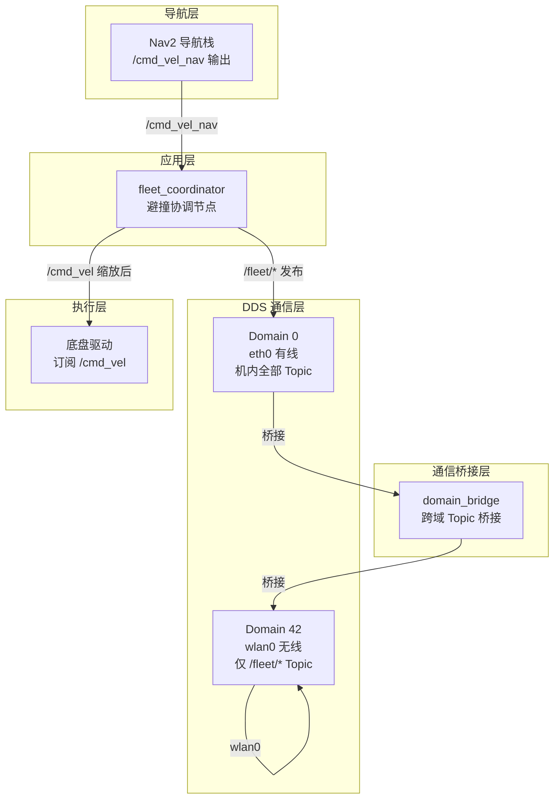
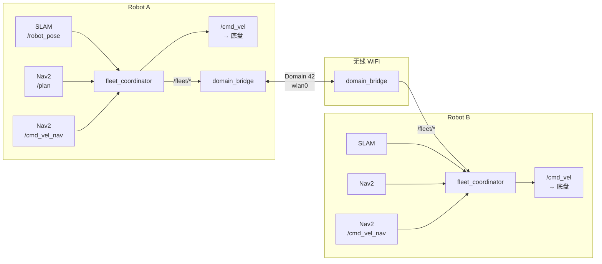
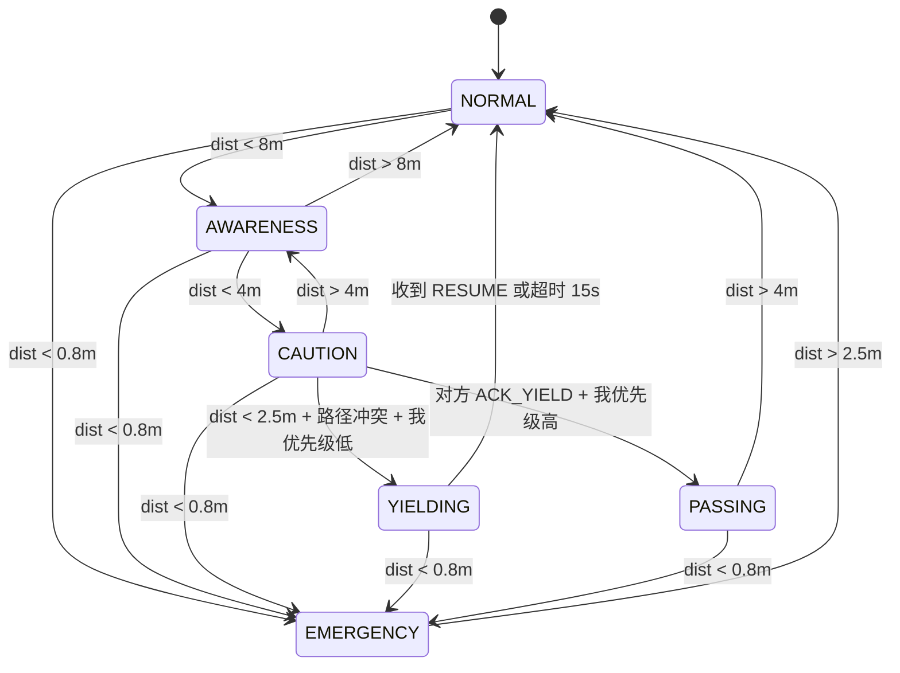
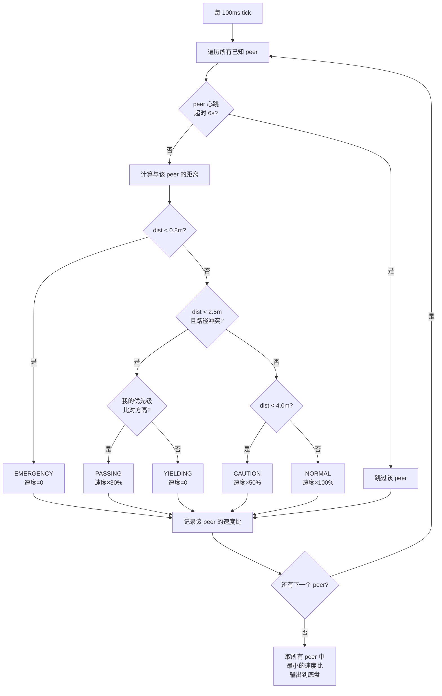
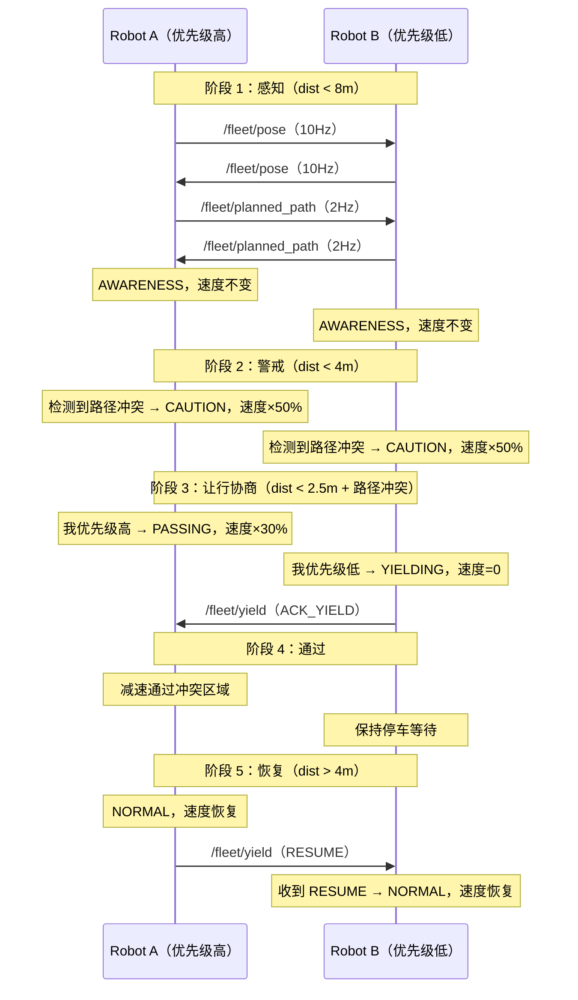
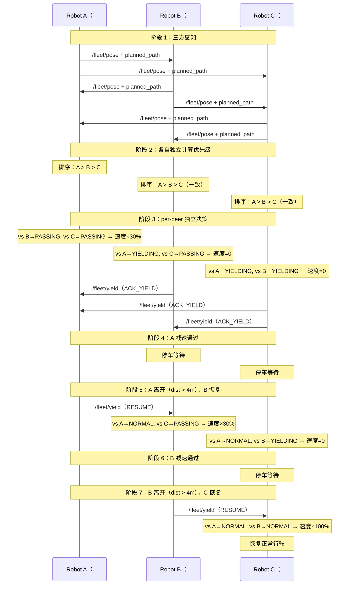
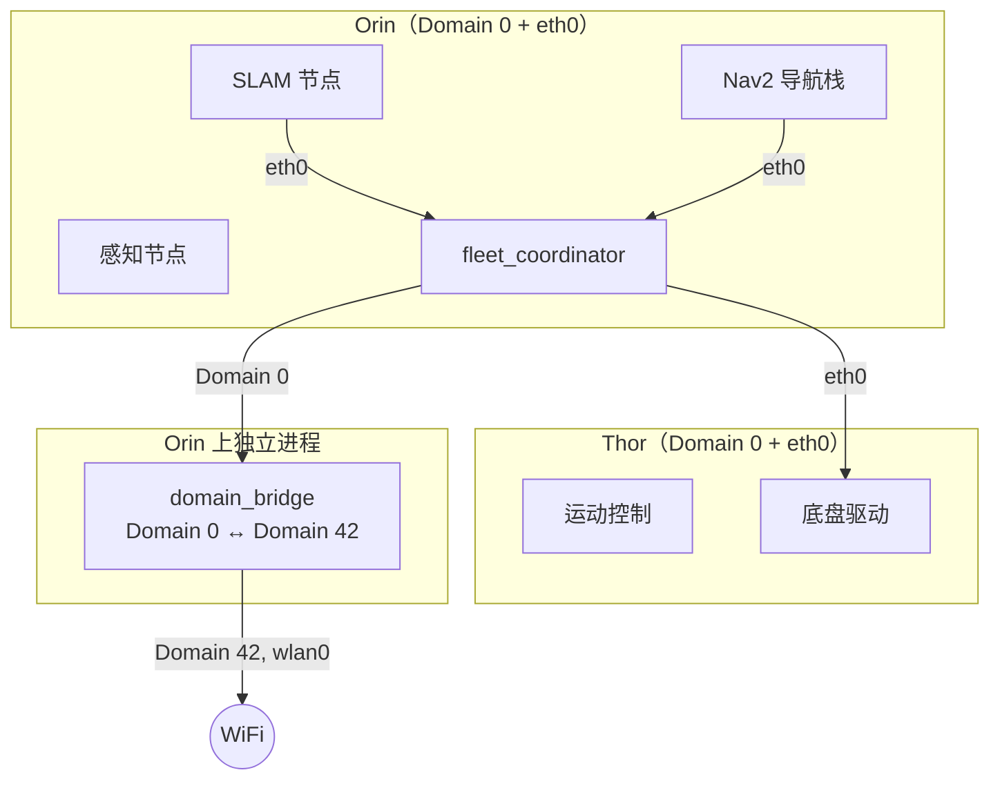

> 自动同步自 Notion，同步时间: 2026-04-15
> 页面 ID: `6cf06f26-0cd5-4c68-914a-45869511d87c`
> 原始链接: https://www.notion.so/6cf06f260cd54c68914a45869511d87c

# 多机避撞协同系统 · 系统架构设计

> 🏗️ **多机避撞协同系统 — 系统架构设计文档（SAD）**
版本 V1.0 · 2026-04-15 · 配套 PRD V1.0

---

## 1. 架构概览

### 1.1 设计原则

- **通信最小暴露**：只有 `/fleet/*` 协同 Topic 走无线，内部数据绝不外泄

- **架构级隔离**：双 DDS Domain 硬隔离，而非防火墙软隔离

- **Nav2 原生集成**：通过自定义行为树节点集成，Nav2 原生理解让行状态，不触发 ProgressChecker 超时

- **确定性决策**：避撞逻辑基于优先级规则，可预测、可审计

- **优雅降级**：通信中断时自动回退到独立运行模式

- **面向扩展**：per-peer 架构，从 2 台扩展到 N 台零改动

### 1.2 系统分层



---

## 2. 通信架构

### 2.1 双 Domain 隔离

| **Domain** | **ID** | **网络接口** | **用途** | **参与节点** |
| --- | --- | --- | --- | --- |
| 内部域 | 0 | eth0（有线） | Orin ↔ Thor 全部内部通信 | SLAM、Nav2、感知、控制、fleet_coordinator |
| Fleet 域 | 42（1F）/ 43（2F）/ … | wlan0（无线） | 机器人间协同 | domain_bridge（唯一） |

**楼层隔离**：每层楼使用不同的 Fleet Domain ID，DDS 层面完全不可见。

### 2.2 数据流架构



### 2.3 domain_bridge 桥接配置

`domain_bridge` 是 ROS 2 官方包（`ros-$ROS_DISTRO-domain-bridge`），在**单进程**内为 Domain 0 和 Domain 42 各创建一个 ROS Context，通过进程内内存拷贝转发指定 Topic。

**桥接白名单**（`/etc/fleet/domain_bridge.yaml`）：

| **Topic** | **类型** | **方向** | **QoS** |
| --- | --- | --- | --- |
| /fleet/heartbeat | fleet_msgs/msg/RobotHeartbeat | 双向 | BestEffort, KeepLast(1) |
| /fleet/pose | fleet_msgs/msg/RobotPose | 双向 | BestEffort, KeepLast(1) |
| /fleet/planned_path | fleet_msgs/msg/PlannedPath | 双向 | BestEffort, KeepLast(1) |
| /fleet/yield | fleet_msgs/msg/YieldCommand | 双向 | Reliable, KeepLast(5) |

白名单中**未列出的 Topic 永远不会出现在无线网络上**。

---

## 3. CycloneDDS 配置

### 3.1 内部域配置：`/etc/cyclonedds/internal.xml`

Orin / Thor 上所有常规节点使用：

```xml
<?xml version="1.0" encoding="UTF-8" ?>
<CycloneDDS xmlns="https://cdds.io/config">
  <Domain id="any">
    <General>
      <Interfaces>
        <NetworkInterface name="eth0" priority="default" multicast="true" />
      </Interfaces>
      <AllowMulticast>true</AllowMulticast>
    </General>
    <Internal>
      <SocketReceiveBufferSize min="4MB" />
      <Watermarks>
        <WhcHigh>500kB</WhcHigh>
      </Watermarks>
    </Internal>
  </Domain>
</CycloneDDS>
```

### 3.2 Bridge 合并配置：`/etc/cyclonedds/bridge.xml`

`domain_bridge` 进程专用，同时参与两个 Domain：

```xml
<?xml version="1.0" encoding="UTF-8" ?>
<CycloneDDS xmlns="https://cdds.io/config">
  <Domain id="0">
    <General>
      <Interfaces>
        <NetworkInterface name="eth0" priority="default" multicast="true" />
      </Interfaces>
      <AllowMulticast>true</AllowMulticast>
    </General>
  </Domain>
  <Domain id="42">
    <General>
      <Interfaces>
        <NetworkInterface name="wlan0" priority="default" multicast="false" />
      </Interfaces>
      <AllowMulticast>false</AllowMulticast>
      <MaxMessageSize>1452B</MaxMessageSize>
    </General>
    <Discovery>
      <Peers>
        <Peer Address="192.168.50.102" />
        <Peer Address="192.168.50.103" />
      </Peers>
      <ParticipantIndex>auto</ParticipantIndex>
      <MaxAutoParticipantIndex>10</MaxAutoParticipantIndex>
    </Discovery>
    <Internal>
      <SocketReceiveBufferSize min="1MB" />
    </Internal>
  </Domain>
</CycloneDDS>
```

---

## 4. 消息定义

### 4.1 fleet_msgs/msg/RobotHeartbeat.msg

```javascript
string    robot_id              # "robot_a" / "robot_b" / "robot_c"
uint8     status                # 0=idle 1=moving 2=yielding 3=fault 4=charging
float32   battery_pct
uint32    yield_count            # 累计让行次数（用于动态优先级计算）
float64   dist_to_goal           # 距目标点距离 (m)（用于动态优先级计算）
builtin_interfaces/Time stamp
```

### 4.2 fleet_msgs/msg/RobotPose.msg

```javascript
string    robot_id
float64   x                     # 地图坐标系 (m)
float64   y
float64   theta                 # 航向角 (rad)
float64   linear_vel            # 当前线速度 (m/s)
float64   angular_vel           # 当前角速度 (rad/s)
builtin_interfaces/Time stamp
```

### 4.3 fleet_msgs/msg/PlannedPath.msg

```javascript
string    robot_id
geometry_msgs/Point[] waypoints # 未来 N 个路径点（截取前方 5m）
float64   estimated_speed       # 预计行进速度
builtin_interfaces/Time stamp
```

### 4.4 fleet_msgs/msg/YieldCommand.msg

```javascript
string    from_robot            # 发起方
string    to_robot              # 目标方
uint8     command               # 0=REQUEST_YIELD 1=ACK_YIELD 2=RESUME 3=EMERGENCY_STOP
float64   conflict_x            # 冲突预测点
float64   conflict_y
builtin_interfaces/Time stamp
```

> 注：三机排队通过 per-peer 独立决策隐式实现（§6.6），无需显式队列字段。

---

## 5. 避撞状态机

### 5.1 状态定义

| **状态** | **速度缩放** | **触发条件** | **退出条件** |
| --- | --- | --- | --- |
| NORMAL | 100% | 默认状态 | dist < 8m |
| AWARENESS | 100% | dist < 8m | dist < 4m 或 dist > 8m |
| CAUTION | 50% | dist < 4m | dist < 2.5m 且路径冲突，或 dist > 4m |
| YIELDING | 0%（停车） | dist < 2.5m + 路径冲突 + 我优先级低 | 收到 RESUME 或超时 15s |
| PASSING | 30% | 对方 ACK_YIELD + 我优先级高 | dist > 4m（已通过） |
| EMERGENCY | 0%（停车） | dist < 0.8m（任何时候） | dist > 2.5m |

### 5.2 状态转移图



### 5.3 距离阈值参数

| **参数** | **默认值** | **说明** |
| --- | --- | --- |
| EMERGENCY_RANGE | 0.8m | 紧急停车，不可协商 |
| YIELD_RANGE | 2.5m | 让行触发距离 |
| CAUTION_RANGE | 4.0m | 减速警戒距离 |
| AWARENESS_RANGE | 8.0m | 开始感知交换距离 |
| PATH_CONFLICT_DIST | 1.5m | 路径点间距冲突阈值 |
| PATH_LOOKAHEAD | 5.0m | 路径前瞻截取长度 |
| HEARTBEAT_TIMEOUT | 6.0s | 心跳超时→降级为独立运行 |
| YIELD_TIMEOUT | 15.0s | 让行超时→自动恢复 |

所有参数通过 ROS 2 Parameter 声明，可在 Launch 文件或运行时修改。

---

## 6. 协商决策流程

### 6.1 核心决策原则

- **去中心化**：每台机器人独立决策，无需中央调度器

- **确定性**：相同输入产生相同结果，所有机器人对"谁让谁"达成一致

- **最保守决策**：同时面对多个 peer 时，取最保守（最慢）的速度

- **防饿死**：动态优先级确保不会有机器人永远让行

### 6.2 单机决策主循环（10 Hz）

每台机器人独立运行以下决策循环，无需协商即可得出一致结论：



### 6.3 路径冲突检测与冲突点计算

<!-- block type: heading_4 -->

截取前方 5m 路径点，任意一对点距离 < threshold（1.5m）即为冲突。加入滞回：冲突标记后需连续 5 个 tick 无冲突才解除（防闪烁）。

```python
def detect_path_conflict(my_path, peer_path, threshold=1.5):
    for my_pt in my_path:
        for peer_pt in peer_path:
            if hypot(my_pt.x - peer_pt.x, my_pt.y - peer_pt.y) < threshold:
                return True
    return False
```

算法复杂度 O(M×N)，M/N 为路径点数。当前规模（3 台、每条路径 ~10 个点）下计算量可接受（~200 次距离计算/tick）。扩展到 10 台以上时可引入空间索引优化。

<!-- block type: heading_4 -->

当 `detect_path_conflict()` 返回 True 时，同时计算冲突点坐标，用于填充 `YieldCommand.msg` 的 `conflict_x` / `conflict_y` 字段：

```python
def find_conflict_point(my_path, peer_path, threshold=1.5):
    """
    在两条路径中找到第一个冲突点。
    冲突点 = 两条路径上距离最近且 < threshold 的一对点的中点。
    返回 (conflict_x, conflict_y) 或 None。
    """
    min_dist = float('inf')
    conflict_point = None
    
    for my_pt in my_path:
        for peer_pt in peer_path:
            dist = hypot(my_pt.x - peer_pt.x, my_pt.y - peer_pt.y)
            if dist < threshold and dist < min_dist:
                min_dist = dist
                conflict_point = (
                    (my_pt.x + peer_pt.x) / 2.0,
                    (my_pt.y + peer_pt.y) / 2.0
                )
    
    return conflict_point
```

**计算原理**：遍历两条路径的所有点对，找到距离最近的一对，取其中点作为冲突预测位置：

```javascript
我的路径：  P0 ── P1 ── P2 ── P3
                              ╲
                               ╲  dist < 1.5m
                                ╳ ← conflict_point = (P3+Q3)/2
                               ╱
对方路径：  Q0 ── Q1 ── Q2 ── Q3
```

**各场景表现**：

| **场景** | **冲突点位置** | **说明** |
| --- | --- | --- |
| 对向行驶 | 两车路径中间的某点 | 两条路径正面交叉 |
| T 字路口 | 路口交汇点附近 | 两条路径在路口处相交 |
| 同向追赶 | 无冲突点（返回 None） | 路径平行，所有点对距离 > 1.5m |

**用途**：`conflict_x` / `conflict_y` 不参与避撞决策（决策基于距离 + 冲突布尔值 + 优先级），作用是：

1. **日志诊断**：WARN 日志中记录冲突发生在地图上的哪个位置，便于运维回溯

1. **RViz 可视化**：在 RViz 中将冲突点标记为 Marker

1. **未来扩展**：后续实现"靠边让行"时需要知道冲突点位置才能计算靠边方向

### 6.4 优先级计算

<!-- block type: heading_4 -->

静态规则：`robot_id` 字典序小的优先通行。简单、确定、无需额外数据。

<!-- block type: heading_4 -->

动态评分，防止饿死：

```javascript
priority_score = yield_count × 10.0
               + (1.0 / dist_to_goal) × 5.0
               + (100 - battery_pct) × 0.1
```

- `yield_count`：累计让行次数（越多优先级越高，防饿死）

- `dist_to_goal`：距目标点的距离（越近优先级越高）

- `battery_pct`：电量百分比（越低优先级越高）

- 评分相同时用 `robot_id` 字典序打破平局

**关键**：所有机器人用相同公式和相同输入数据独立计算，**不需要额外协商即可得出一致排序**。

### 6.5 双机协商时序

以走廊对向行驶为例（Robot A 优先级高，Robot B 优先级低）：



### 6.6 三机协商决策流程

<!-- block type: heading_4 -->

三台机器人（A 优先级 #1，B 优先级 #2，C 优先级 #3）同时接近冲突区域时，每台机器人**独立**对每个 peer 做决策，然后取最保守结果：

| **机器人** | **vs Peer 1** | **vs Peer 2** | **取最保守** | **最终速度** |
| --- | --- | --- | --- | --- |
| **A**（#1） | vs B → 我优先，PASSING（×30%） | vs C → 我优先，PASSING（×30%） | min(30%, 30%) | **×30%** |
| **B**（#2） | vs A → 我让行，YIELDING（0%） | vs C → 我优先，PASSING（×30%） | min(0%, 30%) | **0%（停车）** |
| **C**（#3） | vs A → 我让行，YIELDING（0%） | vs B → 我让行，YIELDING（0%） | min(0%, 0%) | **0%（停车）** |

<!-- block type: heading_4 -->



<!-- block type: heading_4 -->

| **排名** | **行为** | **速度** | **恢复条件** |
| --- | --- | --- | --- |
| #1（最高） | 减速通过，其他人等我 | ×30% | 通过后自动恢复 |
| #2（中间） | 先等 #1 通过，然后我通过，#3 等我 | 先 0%，后 ×30% | 收到 #1 的 RESUME |
| #3（最低） | 等 #1 和 #2 都通过后再走 | 0% | 收到 #2 的 RESUME |

### 6.7 防饿死与异常处理

<!-- block type: heading_4 -->

| **机制** | **说明** |
| --- | --- |
| **让行计数器** | 每次让行后 yield_count +1，下次优先级评分更高。连续让行 3 次后优先级大幅提升 |
| **让行超时** | 单次让行最长 15s，超时后强制恢复行驶 |
| **心跳降级** | 对方心跳丢失 6s 后，视为该 peer 不存在，恢复独立行驶 |

<!-- block type: heading_4 -->

| **异常场景** | **处理方式** |
| --- | --- |
| 任意两台距离 < 0.8m | 不管优先级，双方立即 EMERGENCY STOP |
| 让行中对方消失（WiFi 断连） | 心跳超时 6s → 自动恢复行驶 |
| 让行超时（对方卡住/故障） | 15s 后强制恢复，发送 RESUME |
| #1 通过后 #2 和 #3 同时恢复 | 不会发生。#3 对 #2 仍处于 YIELDING，只有 #2 通过后 #3 才恢复 |
| 新的 #4 机器人加入 | per-peer 架构自动纳入，重新计算排序 |

---

## 7. Nav2 行为树集成

### 7.1 集成方式

协调逻辑通过**自定义 Nav2 行为树节点**集成到 Nav2 的默认行为树中，而非在外部拦截 `cmd_vel`。这样 Nav2 原生理解"正在让行等待"，不会触发 ProgressChecker 超时进入 Recovery 子树。

### 7.2 自定义 BT 节点

| **节点名** | **BT 类型** | **功能** |
| --- | --- | --- |
| CheckFleetConflict | Condition | 每个 tick 检查是否与 peer 路径冲突 + 距离是否进入警戒范围，输出 fleet_state 到黑板 |
| WaitForYieldClear | Action | 让行等待：发布零速度 + 发送 ACK_YIELD，直到收到 RESUME 或超时 15s |
| AdjustSpeedForFleet | Decorator | 包裹 FollowPath，根据 fleet_state 通过 SpeedLimit Topic 动态缩放速度 |

### 7.3 行为树改造位置

在 Nav2 默认行为树 `navigate_to_pose_w_replanning_and_recovery.xml` 的 `FollowPath` 之前插入协调层：

```javascript
原始结构：
  PipelineSequence
    ├── ComputePathToPose (1Hz)
    └── FollowPath

改造后：
  PipelineSequence
    ├── ComputePathToPose (1Hz)
    └── ReactiveSequence "FleetCoordinatedFollow"
        ├── ReactiveFallback "FleetYieldCheck"
        │   ├── Inverter → CheckFleetConflict  (无冲突→跳过)
        │   └── WaitForYieldClear              (有冲突且我让行→停车等待)
        └── AdjustSpeedForFleet                (速度缩放)
            └── FollowPath                     (原始 controller)
```

**关键**：`ReactiveSequence` 每个 tick 都从 `FleetYieldCheck` 开始重新评估——即使 `FollowPath` 正在执行中，一旦检测到冲突也会立即触发让行。

### 7.4 路径获取

`CheckFleetConflict` 节点从 BT 黑板读取 `{path}`（由 `ComputePathToPose` 写入），截取前方 5m 路径点用于冲突检测。

### 7.5 与 Recovery 子树的交互

- 让行等待期间 `WaitForYieldClear` 返回 RUNNING，Nav2 不会触发 ProgressChecker 超时

- 如果让行超时（15s）强制恢复，`WaitForYieldClear` 返回 SUCCESS，恢复 `FollowPath`

- 如果新 Goal 到达（`GoalUpdated`），`WaitForYieldClear` 的 `onHalted()` 自动发送 RESUME 并终止让行

---

## 8. 多机扩展架构（per-peer 实现）

本章描述 §6 协商决策流程的**代码级实现架构**。决策逻辑（状态机、优先级计算、排队机制）详见 §6，此处仅关注数据结构和扩展性设计。

### 8.1 核心数据结构

```python
@dataclass
class PeerState:
    robot_id: str
    x: float = 0.0
    y: float = 0.0
    theta: float = 0.0
    vel: float = 0.0
    last_seen: float = 0.0
    planned_path: list = field(default_factory=list)
    coordination_state: State = State.NORMAL  # per-peer 独立状态
    yield_start_time: float = 0.0
    yield_count: int = 0                      # 累计让行次数

class FleetCoordinator(Node):
    def __init__(self):
        self.peers: Dict[str, PeerState] = {}  # 动态管理所有 peer
```

### 8.2 决策原则

**对每个 peer 独立评估，取最保守结果：**

```python
def _coordination_tick(self):
    worst_ratio = 1.0
    for peer_id, peer in self.peers.items():
        if self._is_peer_timeout(peer):
            continue
        ratio = self._evaluate_single_peer(peer)
        worst_ratio = min(worst_ratio, ratio)
    self._output_velocity(worst_ratio)
```

### 8.3 扩展 N 台时的改动点

| **模块** | **2→3 台改动** | **3→N 台改动** |
| --- | --- | --- |
| fleet_coordinator | 已经是 per-peer 架构，无需改动 | 无需改动 |
| domain_bridge.yaml | 无需改动（Topic 级配置） | 无需改动 |
| fleet.xml Peers 列表 | 增加新机器人 IP | 增加新机器人 IP |
| 优先级算法 | 已支持动态评分 | 无需改动 |
| 排队机制 | N 方排队 | 无需改动 |

---

## 9. 部署架构

### 9.1 单台机器人进程模型



### 9.2 环境变量

| **变量** | **常规节点** | **domain_bridge** |
| --- | --- | --- |
| ROS_DOMAIN_ID | 0 | （内部管理） |
| RMW_IMPLEMENTATION | rmw_cyclonedds_cpp | rmw_cyclonedds_cpp |
| CYCLONEDDS_URI | /etc/cyclonedds/internal.xml | /etc/cyclonedds/bridge.xml |

### 9.3 启动命令

```bash
# Robot A (Orin)
export ROS_DOMAIN_ID=0
export CYCLONEDDS_URI=file:///etc/cyclonedds/internal.xml
ros2 launch robot_bringup full_stack.launch.py

ros2 launch fleet_coordination fleet_bringup.launch.py \
    robot_id:=robot_a peer_ips:="[192.168.50.102,192.168.50.103]"
```

---

## 10. 无线带宽预算

| **Topic** | **频率** | **单帧大小** | **2 台带宽** | **3 台带宽** |
| --- | --- | --- | --- | --- |
| /fleet/heartbeat | 0.5 Hz × N | ~48 B | 48 B/s | 72 B/s |
| /fleet/pose | 10 Hz × N | ~64 B | 1.3 KB/s | 1.9 KB/s |
| /fleet/planned_path | 2 Hz × N | ~200 B | 800 B/s | 1.2 KB/s |
| /fleet/yield | 事件触发 | ~80 B | ≈ 0 | ≈ 0 |
| **总计** |  |  | **~2.2 KB/s** | **~3.2 KB/s** |

远低于 10 KB/s 的预算目标。

---

## 11. 文件结构

```javascript
~/ros2_ws/src/
├── fleet_msgs/                          # 消息定义包
│   ├── msg/
│   │   ├── RobotHeartbeat.msg
│   │   ├── RobotPose.msg
│   │   ├── PlannedPath.msg
│   │   └── YieldCommand.msg
│   ├── CMakeLists.txt
│   └── package.xml
│
├── fleet_nav2_bt/                       # Nav2 行为树插件包（C++）
│   ├── src/
│   │   ├── check_fleet_conflict.cpp     # CheckFleetConflict Condition 节点
│   │   ├── wait_for_yield_clear.cpp     # WaitForYieldClear Action 节点
│   │   └── adjust_speed_for_fleet.cpp   # AdjustSpeedForFleet Decorator 节点
│   ├── include/
│   ├── behavior_trees/
│   │   └── navigate_with_fleet.xml      # 改造后的行为树 XML
│   ├── CMakeLists.txt
│   └── package.xml
│
├── fleet_coordination/                  # 协同逻辑包（Python）
│   ├── fleet_coordination/
│   │   ├── fleet_coordinator.py         # 核心协调节点
│   │   └── peer_state.py                # PeerState 数据结构
│   ├── launch/
│   │   └── fleet_bringup.launch.py      # 启动文件
│   ├── config/
│   │   ├── domain_bridge.yaml           # 桥接白名单
│   │   └── coordinator_params.yaml      # 阈值参数
│   ├── test/
│   │   ├── test_state_machine.py        # 状态机单测
│   │   ├── test_priority.py             # 优先级单测
│   │   └── test_path_conflict.py        # 路径冲突单测
│   ├── setup.py
│   └── package.xml
│
/etc/
├── cyclonedds/
│   ├── internal.xml                     # 常规节点 DDS 配置
│   └── bridge.xml                       # domain_bridge DDS 配置
└── fleet/
    └── domain_bridge.yaml               # Topic 桥接白名单
```

---

## 12. 验证计划

### 12.1 单元测试

| **测试项** | **验证内容** | **方法** |
| --- | --- | --- |
| 状态机转移 | 所有状态转移路径正确 | pytest + mock |
| 优先级计算 | 2 台字典序 / 3 台动态评分正确 | pytest |
| 路径冲突检测 | 平行路径不冲突 / 交叉路径冲突 | pytest + 构造路径 |
| 速度缩放 | 各状态输出速度比正确 | pytest |
| 超时保护 | 让行超时 / 心跳超时正确触发 | pytest + mock time |

### 12.2 集成测试

| **测试场景** | **通过标准** |
| --- | --- |
| 通信隔离验证 | tcpdump wlan0 无非 /fleet/* DDS 包 |
| domain_bridge 桥接验证 | Domain 42 只看到 4 个 Fleet Topic |
| 对向行驶避撞 | 低优先级方靠边停车，高优先级方通过后双方恢复 |
| 同向追赶 | 后方减速保持安全距离，无不必要让行 |
| T 字路口交汇 | 路口前完成协商，无碰撞 |
| 三方交汇（扩展） | 排队依次通过，无死锁/饿死 |
| WiFi 断连降级 | 断连 6s 后回退独立运行，不死锁 |
| domain_bridge 崩溃恢复 | systemd 重启后自动恢复通信 |

### 12.3 稳定性测试

- 连续 7 天 × 8h 运行

- 覆盖场景：对向、同向、T 字路口、三方交汇随机组合

- 指标：零碰撞、让行延迟 ≤ 15s、无线带宽 ≤ 10 KB/s

---

## 13. 可观测性设计

### 13.1 结构化日志

每次状态转换输出 INFO 级别日志：

```javascript
[fleet_coordinator] [INFO] STATE_CHANGE robot=robot_a peer=robot_b
  old_state=CAUTION new_state=YIELDING dist=2.3m reason=path_conflict+low_priority
```

让行事件（YIELDING / PASSING / EMERGENCY）输出 WARN 级别日志，含冲突坐标和持续时间。

### 13.2 诊断 Topic

发布 `/fleet/coordinator_status`（1Hz，BestEffort），含：

- 本机 robot_id 和当前整体状态

- peer 列表（每个 peer 的 robot_id、距离、协调状态、优先级评分）

- 当前输出速度比

该 Topic **不经过 domain_bridge**，仅留在 Domain 0 内部，供本机调试和日志采集使用。

---

## 14. 未来扩展方向

| **方向** | **说明** | **切入点** |
| --- | --- | --- |
| 云端监控 | Fleet 状态上报到运维 Dashboard | 用 Zenoh Bridge 替换 domain_bridge，天然支持跨域 |
| 靠边策略 | 让行时不只停车，计算靠边位置让出通道 | fleet_coordinator 增加 yield_planner 子模块 |
| 异构混编 | 不同底盘/尺寸的机器人混合编队 | 消息中增加 robot_type / footprint 字段 |
| 跨楼层协同 | 电梯/通道处的楼层间协调 | 通过 Zenoh Router 桥接不同 Fleet Domain |
| 全局任务调度集成 | 避撞系统与 Fleet Manager 联动 | fleet_coordinator 暴露 Service 接口给调度器 |
